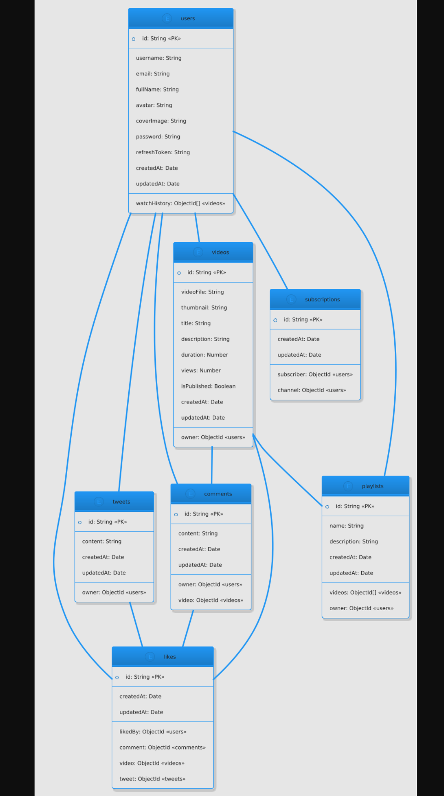

<h1> MediaStream Backend </h1>

This project delivers a robust API backend focusing on comprehensive user authentication, account management, and content-related profile features. While drawing inspiration from the user experience of platforms like YouTube, it serves as a foundational demonstration of implementing core backend services and best practices.

 

<h3>Technologies & Tools: </h3>
<ul>
  <li><strong>Node.js:</strong> JavaScript runtime for server-side execution.</li>
  <li><strong>Express.js:</strong> Fast, minimalist web framework for Node.js, used for building the API.</li>
  <li><strong>MongoDB Atlas:</strong> Cloud-hosted database for flexible and scalable data storage.</li>
  <li><strong>Mongoose:</strong> ODM (Object Data Modeling) library for MongoDB and Node.js, providing schema-based solutions to model application data.</li>
  <li><strong>Cloudinary:</strong> Cloud-based image and video management service, utilized for handling and storing user avatars and cover images.</li>
  <li><strong>JSON Web Tokens (JWT):</strong> Secure and compact industry-standard method for representing claims between two parties, used for user authentication and authorization.</li>
  <li><strong>Postman:</strong> API platform for building, testing, and documenting APIs. Essential for interacting with and demonstrating this backend.</li>
</ul>
 
<h3> Key Features & API Endpoints :</h3>

 This API provides a range of functionalities designed to manage user identities and associated data. All features have been rigorously tested using Postman.

<h4> Account and Authentication management:</h4>
<ul>
  <li><strong>User Registration:</strong> Securely register new user accounts with data persisted in MongoDB.</li>
  <li><strong>User Login:</strong> Authenticate users against stored credentials, issuing JWTs for subsequent authorized requests.</li>
  <li><strong>User Logout:</strong> Invalidate user sessions by managing JWTs.</li>
  <li><strong>Password Change:</strong> Allow authenticated users to update their passwords securely.</li>
  <li><strong>Refresh Token Management:</strong> Implement a mechanism to refresh authentication tokens without re-logging in.</li>
</ul>
<h4> User Profile & Content Integration:</h4>
<ul>
  <li><strong>Avatar Management:</strong> Enable authenticated users to upload and change their profile avatars via Cloudinary integration.</li>
  <li><strong>Cover Image Management:</strong> Allow authenticated users to upload and change their profile cover images via Cloudinary.</li>
  <li><strong>Account Details Update:</strong> Facilitate updating user profile information (e.g., username, email).</li>
  <li><strong>User Channel Information:</strong> Retrieve comprehensive details about a user's channel, including subscriber count, a list of subscribers, and subscriptions. This leverages MongoDB Aggregation Pipelines for efficient data retrieval.</li>
  <li><strong>Watch History Management:</strong> Retrieve a user's watch history.</li>
</ul>
